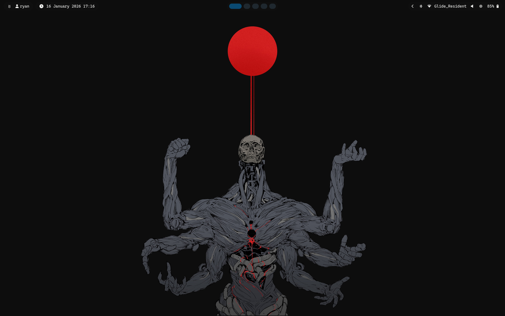
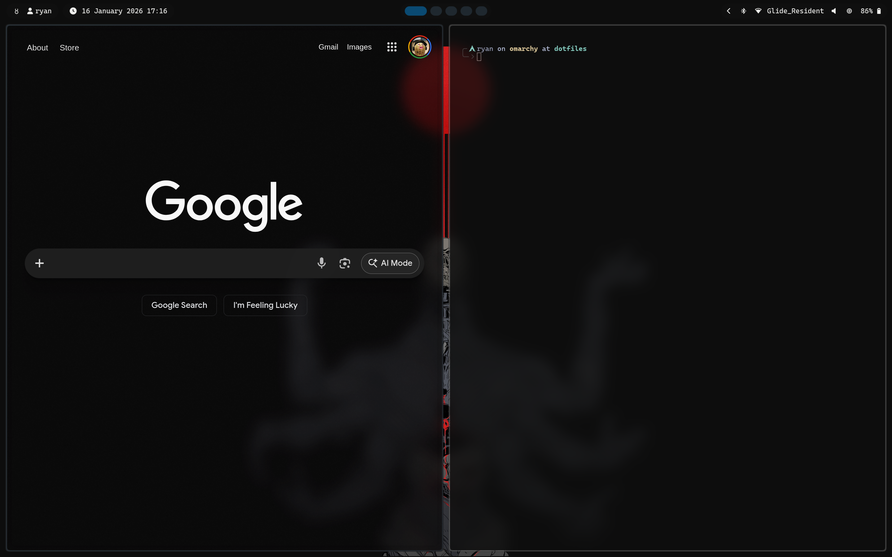
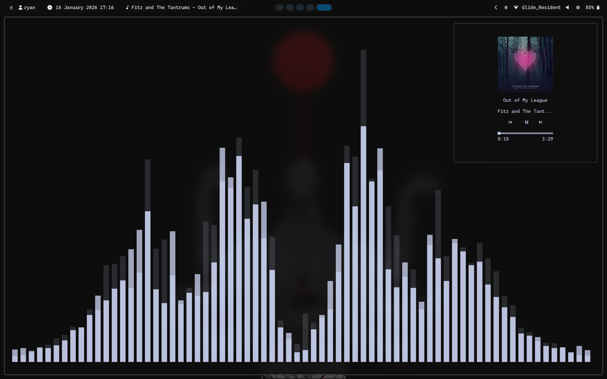

✦ Ryan's Dotfiles - Hyprsalt

A curated collection of configuration files that build upon the base Omarchy. Managed with GNU Stow.

<details>
<summary>🖼  Preview</summary>

<br>

<br>

<br>

</details>

⚡ Quick Start

The fastest way to get up and running is using the included interactive installer.
1. Prerequisites

Ensure you have the core logic (stow) and the interface engine (gum) installed:
```
Arch Linux: sudo pacman -S stow gum git
```

2. Installation

Clone the repository and launch the TUI:
```
git clone https://github.com/RNAV2019/dotfiles.git ~/.dotfiles
cd ~/.dotfiles
chmod +x install.sh
./install.sh
```

📦 Included Packages
| Package  | Component	    | Description                                            |
| -------- | -------------- | ------------------------------------------------------ |
| hypr	   | Window Manager	| Hyprland compositor settings & keybinds.               |
| waybar	 | Status Bar	    | Highly customized top bar with system info.            |
| ghostty	 | Terminal	      | GPU-accelerated, high-performance terminal.            |
| helix	   | Editor	        | Modal text editor with built-in LSP support.           |
| matugen	 | Theming	      | Material You color generation for the whole system.    |
| mako	   | Notifications	| Lightweight notification daemon.                       |
| swww	   | Wallpaper	    | Animated wallpaper daemon.                             |
| swayosd	 | OSD	          | Visual indicators for volume and brightness.           |
| bash	   | Shell	        | Environment variables, aliases, and prompt.            |
| fum	     | Music          | UI	Aesthetic frontend for MPD music control.          |
| music	   | Music          | Shell script to open fum and cava on the 5th workspace |
| omarchy	 | System         |	Core overrides and Omarchy-specific tweaks.            |
| branding | Theming        | Scripts to theme to Hyprsalt                           |

3. Login (Plymouth)

To change the login image:
```
cp logo.png /usr/share/plymouth/themes/omarchy/logo.png
```

🛠️ Manual Management

If you prefer to skip the TUI, you can manage packages directly using standard GNU Stow commands from the root of this directory:
```
Install a package: stow package_name

Remove a package: stow -D package_name

Refresh a package: stow -R package_name

[!WARNING] Conflict Resolution: Stow will not overwrite existing files. If you see an error, back up your existing config (e.g., mv ~/.bashrc ~/.bashrc.bak) and run the installer again.
```

🎨 Aesthetic Philosophy

This setup utilizes Matugen to tastefully configure waybar. By changing your wallpaper Omarchy either using the keybind or the menu, the waybar and wallpaper can be dynamically updated to match with aesthetically pleasing animations.
📜 License

MIT © Ryan Navsaria

